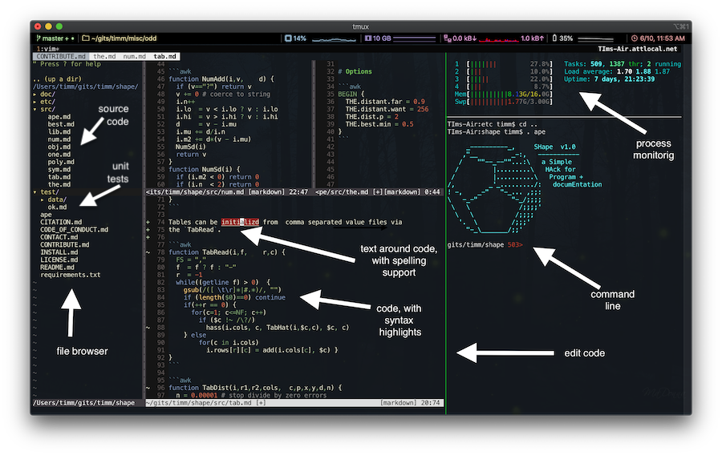

<a name=top>
<h1 align=center>
   <a href="https://github.com/timm/shape/blob/master/README.md#top">
     SHape = SHell tricks  for Any Program + documeEntation
   </a>
</h1>
<p align=center>
   <a    href="https://github.com/timm/shape/blob/master/LICENSE.md#top">license</a>
   :: <a href="https://github.com/timm/shape/blob/master/INSTALL.md#top">install</a>
   :: <a href="https://github.com/timm/shape/blob/master/CONTRIBUTE.md#top">contribute</a>
   :: <a href="https://github.com/timm/shape/issues">issues</a>
   :: <a href="https://github.com/timm/shape/blob/master/CITATION.md#top">cite</a>
   :: <a href="https://github.com/timm/shape/blob/master/CONTACT.md#top">contact</a>
</p>
<p align=center>
   
</p>
<p align=center>
   
   
   
   <a href="https://travis-ci.org/github/timm/shape"> </a>
   <a href="https://doi.org/10.5281/zenodo.3887420"></a>
</p>

## How

To get started, see our [install](INSTALL.md) instructions and our
[guide for contributors](CONTRIBUTING.md).


## What

- GAWK is very portable, very succinct, scripting language. 
  - It lacks encapsulation and packaging tools, an IDE, unit testing standards, or document generation tools. 
  - Which is all easily fixed with a few scripts written in, you guessed it, GAWK.
- GOLD is an object layer that extends GAWK with objects, aggregation, polymorphism and inheritance. 
- GOLDMINE are some data mining tools written in GOLD.
- GOLDSTAR are a set of data mining fairness assurance operators. 
- GOLDEN is a cross-platform development environment for the above,  based on bash, vim and tmux. 
  A session in GOLDEN looks like this:

<p align=center><a href="etc/img/screen.png"></a></p>

To support easy documentation

- GOLD code is stored in `x.md`  Markdown files (so can mix code and doc) 
- There are also scripts to 
  - Add a table of contents to your Markdown, if you want them.
  - Share a common header across all `*.md` files (copied over from para1 of the main `README.md`)

To support easier access to nested array contents:
- GOLD extends GAWK with a Python-like dot notation 
  - e.g  `a.b.c = 2.3` becomes `a["b"]["c"] = 2.3`. 
  - Note that GOLD knows not to alter  the decimal point in 2.3

To implement that dot notation, the GOLD interpreter (celled `gold`):

- Transpiles code  from `src/\*.md`  to  `.var/x.awk`. That transpiler is a one line long:


```awk
s= gensub(/\.([^0-9\\*\\$\\+])([a-zA-Z0-9_]*)/,"[\"\\1\\2\"]","g",s)
```


To support object creation aggregation, and inheritance 
- There is  30 likes of portable awk (so not preprocessing needed there)

To support polymorphism, 
- All  objects have a type field called   "ois". 
- This, plus indirect functions, are  used to defined  polymorphic verbs e.g.

```awk
function show(i,   f) { f=i.ois "Show";  return @f(i) }
function doing(i,  f) { f=i.ois "Doing";  return @f(i)}
```    

To better support include libraries:
- GOLD code rarely using `PATTERN {ACTION}` or `END {ACTION}` since those constructs assume that they are
  the main controllers, not some sub-routine.
- GOLD code rarely defines glolals. The current code base only uses two globals:
  - `GOLD` : stores some system information. Defined in `src/obj.md`.
  - `MY`   : stores constants. Defined in `src/my.md`. 

To support automatic unit testing:
- Code in `src/x.md` has a test file `test/xok.md`. 
- A shell script changes to /test and rules all the \*ok.md files
- A .travis.yml file uses that script to retest the code after each commit

To support easy install and uninstall:
- All files in GOLDEN are defined relative to the position of the  main `gold`. 
- So installation is mostly just unzipping a file to a directory
- And uninstalling is just zapping that directory.


## Example
Here's an iterator that prunes away columns that start with a "?" in their name. 
The result is the variable `i.cells`, which  is reset for every step of the loop.


     Row(it, "somecsvfile")    # Row defines "it", which is the iterator
     while( Doing(it) ) { # Rows runs the Row interator
       print it.cells[1]

Fyi- having coded this iterator in lua and python and coffeescript, I can assert that that the following is 
the simplest implementation 
I've yet seen 

```awk
function Row(i,file) {
  Object(i)
  is(i,"Row")
  i.file = file
  has(i,"use") # aggregation
  has(i,"cells") # aggregation
  i.r = -1
}
function RowDoing(i,   c,tmp,n) {
  if (!csv(tmp,i.file))   # iterators can be nested; e.g. csv is another iterator
    return 0              # signal end of iterator
  if (!length(i.use))     # the initialization step. only called for first rows
    for(c in tmp)
      if (tmp[c] !~ /\?/)
        i.use[c] = ++n;
  i.r++
  for(c in i.use)
    i.cells[i.use[c]] = tmp[c]
  return 1                # signal to continue the iteration
}
```
Iterators can be nested. e.g. the above code calls the `csv` iterator (no new objects here,  just good old GAWK):

```awk
function csv(a,file,     b4, status,line) {
  file   = file ? file : "-"            # can read from standard in
  status = getline < file
  if (status<0) {                       # complain about missing files
    print "#E> Missing file ["file"]"
    exit 1                              # crash on error
  }
  if (status==0) {
    close(file)
    return 0                            # signal that iteration can continue
  }
  line = b4 $0
  gsub(/([ \t]*|#.*$)/, "", line)       # no spaces or comments
  if (!line)
    return csv(a,file, line)            # skip blank likes
  if (line ~ /,$/)
    return csv(a,file, line)            # join lines ending with "," to next line
  split(line, a, ",")                   # reset the output  list
  return 1                              # signal that iteration can continue
}
```
